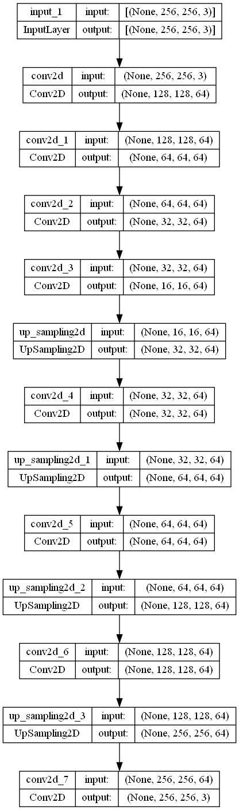

# Convolution-and-autoencoding

The aim of this project is to understand convolution layers .
Hence for each layer , I am saving the layer-output images in a separate folder for visualization.

To add to the aim , I have made a simple autoencoder type model structure ,

In the model achitecture the first 4 layers are downsampling the inuput image , later 4 are upsampling , regularisation and relu activation is used .
 

 

the areas which i believe (for now) that can be imporved are , change in model architecutre by adding skip connections like RESNets and changing the loss function . 
I also wish to run this model for 100 epochs , and after every 5/10 epoch , save images of the predicted output and , of some selected kernels ..
and after viewing these 10/20 images we can see how the images are evolving .

*I also tried to save images of kernels , however , from layer 2 , size of the kernels become ( 3,3,64,64) so 64x64 images will be saved ..
the saving of image of kernels like the above will also help us see the evolution of the kernels .

The project for now is completed.
